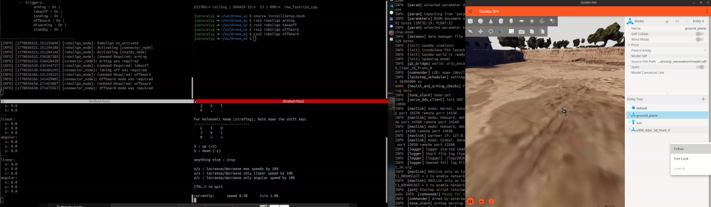

# roboligo

[](https://github.com/juanscelyg/roboligo/actions/workflows/main.yml)

Roboligo is a centralized command interface layer that bridges navigation stacks and hardware interfaces for robotic systems. It provides a unified abstraction for robot control, simplifying the complexity of managing diverse hardware implementations while maintaining compatibility with standard navigation algorithms.



## Key Features

- **Centralized Command Interface**: Standardize robot instructions across different platforms
- **Hardware Abstraction Layer**: Decouple navigation logic from hardware-specific implementations
- **Modular Design**: Easy integration with various robot morphologies and sensor configurations

This architecture allows developers to focus on high-level navigation strategies without worrying about the underlying hardware details, fostering innovation and accelerating development cycles in robotic applications.

The connectors components are designed to be modular and extensible, allowing for easy integration of new robot types and hardware configurations. This flexibility ensures that roboligo can adapt to a wide range of robotic platforms, from wheeled robots to legged systems, while maintaining a consistent interface for navigation and control. This is possible to use plugins to connect and configure any robot.

## Installation

### Clone and Build

```bash
cd ~/ros2_ws/src
git clone https://github.com/juanscelyg/roboligo.git
cd ~/ros2_ws
colcon build
source install/setup.bash
```

## Quick Start

Launch roboligo with:

```bash
ros2 launch roboligo roboligo_launch.py 
```

Replace `your_params_file.yaml` with the path to your configuration file containing robot-specific parameters.

The structure of the configuration file is shown below:

```yaml
states_node:
  ros__parameters:
    use_sim_time: true
    robot_types: [<robot_type>]
    <robot_type>:
      plugin: <plugin_name>

connector_node:
  ros__parameters:
    use_sim_time: true
    connector_types: [<connector_type>]
    <connector_type>:
      plugin: <plugin_name>

roboligo_node:
  ros__parameters:
    use_sim_time: true
    robot_name: <robot_name>
    input_topic: <topic_name>
    stamped: <use_stamped>
```

## Usage

Once roboligo is running, you can send commands to the robot using standard ROS 2 cli. For example, to send an instruction to specific trigger configured previously in a plugin, you can use:

```bash
`ros2 roboligo <trigger_name>`
```

Where `<trigger_name>` corresponds to the name of the trigger defined in your configuration. This command will send the appropriate instruction to the robot based on the configured trigger, allowing for seamless control and interaction with the robotic system.

Currently is available the following triggers:

- `arming`: Arm the robot
- `disarming`: Disarm the robot
- `takeoff`: Command the robot to take off
- `landing`: Command the robot to land
- `offboard`: Command the robot to offboard mode
- `standby`: Command the robot to keep the robot at current position

Those implementation are available using plugins (more plugins coming soon) and can be used for any robot, but currently are tested with a quadrotor.

## Integration

Roboligo is developed in collaboration with [EasyNav](https://github.com/easynavigation), a navigation framework from the [Intelligent Robotics Lab](https://intelligentroboticslab.gsyc.urjc.es/) at URJC.

## Future Developments

Upcoming releases will extend support for diverse robot morphologies:

- Quadruped locomotion systems
- Bipedal robots
- Underwater vehicles (AUVs)

These extensions will maintain the same centralized interface paradigm, enabling seamless control across different robotic platforms.

## Contributing

Contributions to roboligo are welcome! Please follow these guidelines:

1. Fork the repository and create a new branch for your feature or bug fix.
2. Ensure your code adheres to the existing style and includes appropriate documentation.
3. Submit a pull request with a clear description of your changes and the problem they address.

## License

This project is licensed under the Apache License 2.0. See the LICENSE file for details.
